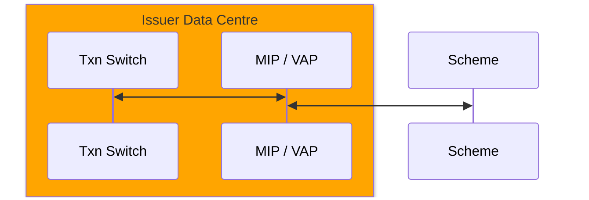

RANDOM NOTES

## Traditional Payment Protocals
POS - Acquirer, Acquirer - Scheme, Scheme - Issuer
1. Protocol - TCP/IP Socket
2. Message Format - ISO8583

### Authorization Technical Flow 

1. MA / Visa provide a hardware / software system called MIP (Mastercard Interface Processor) / VAP (Visa Access Point) to issuer that controls a communication with Banknet / VisaNet over TCP/IP socket
